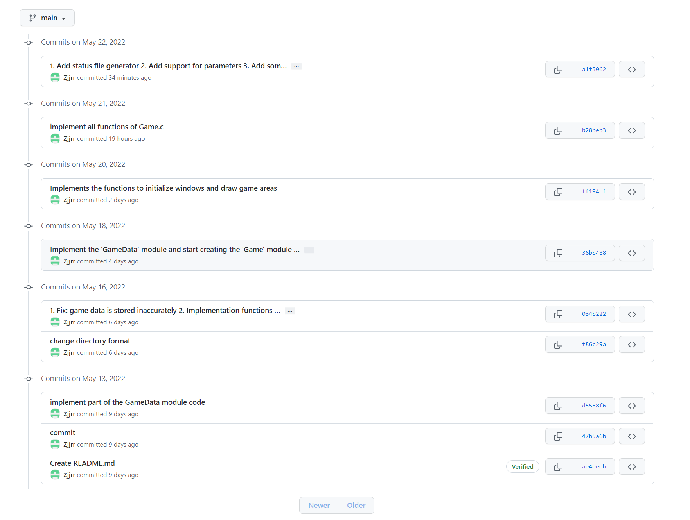

# COPMP1921 Programming Project cCWK2
## Build
`git clone https://github.com/Zjjrr/cCWK2.git && cd cCWK2 && make` 
## Usage
### Play
*Function*: Play status file  
`./game load <file_path>`  
*Example*:  `./game load qbs.dat`  
*Example*: `./game load pulsar.dat`  
*Contorls*: `[SPACE]` Replay  `[ESC]` Save and Quit  `[ENTER]` Manual Play
### Create
*Function*: Create status file  
`./game make <file_path> <world_width> <world_height> <total_step> <play_delay(ms)>`  
*Example*: `./game create test.dat 10 10 0 500`  
*Contorls*: `[ENTER]` Save and Quit  `[ESC]` Save and Quit  `[Mouse Click]` Set Point Status
#### 

